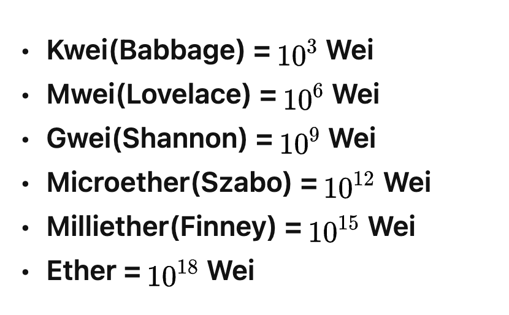

# 币安 出入金

## 内容列表

- [打包和安装](#打包和安装)
- [使用说明](#使用说明)
    - [出入金逻辑](#出入金逻辑)
    - [eth单位换算](#eth单位换算)
    - [测试地址](#测试地址)
- [注意事项](#注意事项)
- [相关仓库](#相关仓库)

## 安装
#### 普通安装
前端代码构建后，将生成的代码放入`public/front`下面,然后使用`gf build main.go --name binance-collect --pack public -s linux,windows,darwin -a amd64,arm -p ./bin` 构建应用程序

## 使用说明

#### 出入金逻辑

#### eth单位换算

如下所示，1ether等于1018wei,所以在mysql中存储以wei作为单位的数值使用varchar类型存储，存储ether的数值使用decimal类型存储。

#### 测试地址

- 用户地址
    - 地址：0x81023633832221b512018a21f8a3c6a6fe774913
      私钥：0x841176e4948f90ea6f237d405ebd25eb0eec4b860f1e5cf76f6541c886353241
- 第三方地址
    - 地址：0x991195b40a5bDF4725AfbD4f10F579BCa25308F5 私钥：81bef96cefdc28f6e77256dff93a6c56f9953796a251ae796aa27ec196b26c03
- 平台地址
  地址：0x8520e2ea780e400ab87322d04c158267f36f733a
  私钥：0x71fd0f4671de2bccccd803be24256591ef5c7bc524f3784db720c100e760f4cb

- 手续费地址
  地址：0x92b1e4c92c506a95fc6b1af465eab8dab8f39ab7
  私钥：0xb9d36a8552bdb5e2cf78b9908a9569911539417d743d34d73e7d52be3ae49b61

## 相关仓库

