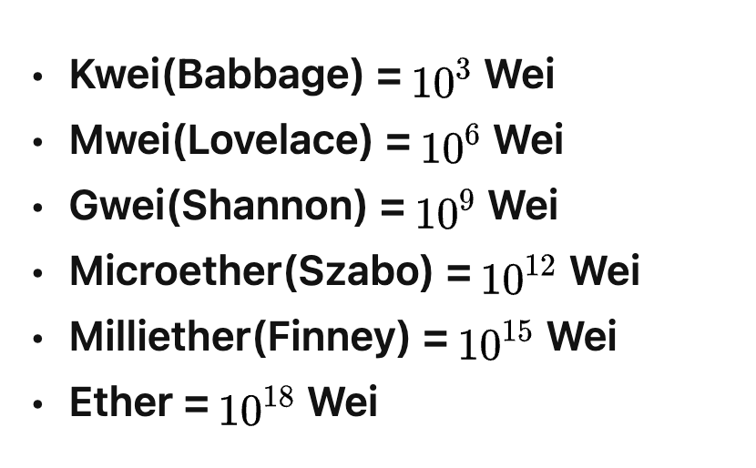
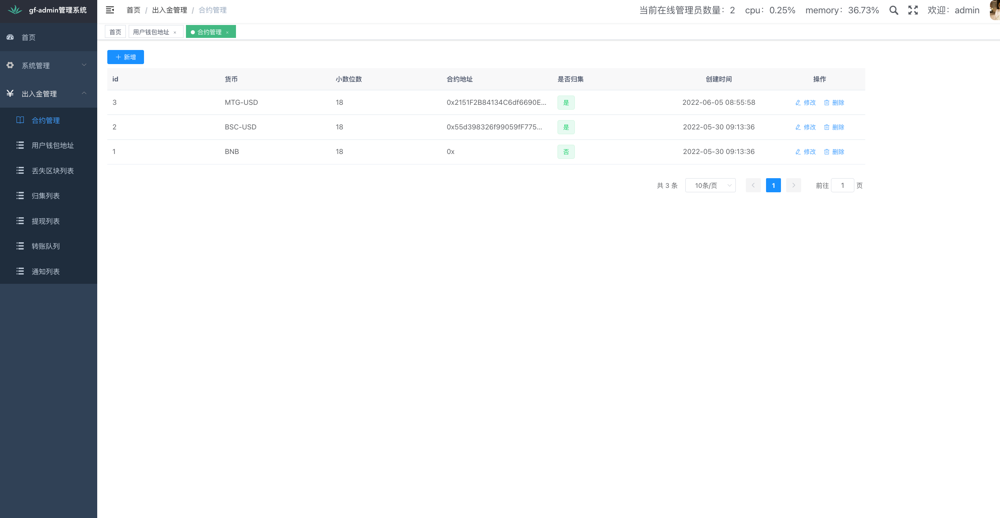
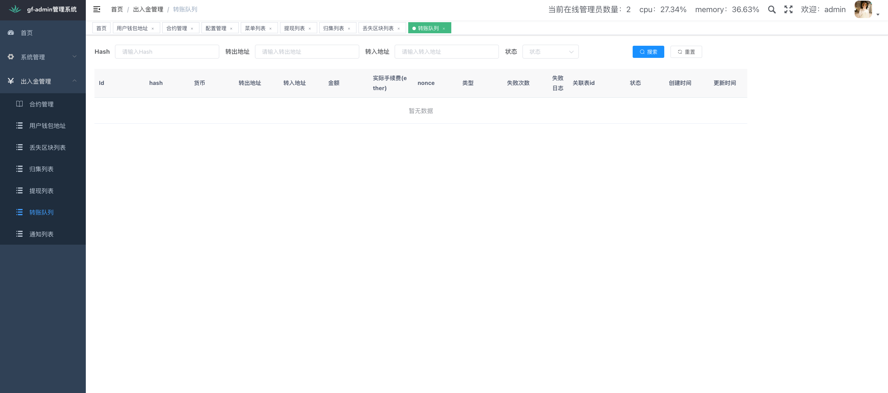
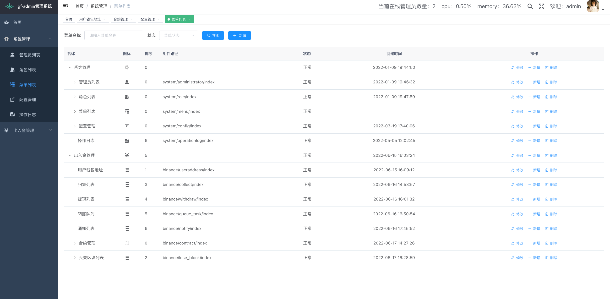

# 币安 出入金

[](https://github.com/RichardLitt/standard-readme)

## 内容列表

- [安装和运行](#安装和运行)
- [注意事项](#注意事项)
- [使用说明](#使用说明)
    - [出入金逻辑](#出入金逻辑)
    - [eth单位换算](#eth单位换算)
    - [测试地址](#测试地址)
- [接口对接](#接口对接)
- [相关仓库](#相关仓库)

## 安装和运行

redis可选，当token.CacheMode设置为cache时，即使用gcache，此时不需要redis,使用gcache会有一个问题，即服务重启时，后台用户需要重新登录

#### 本地环境通过源码运行

1. 创建mysql数据库后，导入document下的binance-deploy.sql文件，修改config/config-local.toml相关配置
2. 测试运行： ` export GF_ADMIN_ENV_FILE=local; gf run main.go`

#### 生产环境安装和运行

1. 编译和上传：修改deploy.sh的相关变量后，运行deploy.sh
2. 创建mysql数据库后，导入document下的binance-deploy.sql文件，修改config/config-local.toml相关配置
4. 如果是内网访问不需要开放端口或设置域名，如果是外网访问需要开放端口或设置域名
5. 将编译后的文件上传到服务器后，使用`nohup ./binance-collect &`运行应用程序

#### docker安装和运行

docker 运行只需要dockerfiles文件夹，将bin/linux_amd64/binance-collect复制到dockerfiles,然后运行dc up,数据库通过3307查看，docker 运行没有使用redis


## 注意事项
- 后台默认用户名和密码为：admin 123456
- 后台服务运行在配置文件的server.Address端口中，出入金接口运行在binance.Port端口中，后台服务需要外网访问可以通过nginx配置反向代理，出入金接口则禁止外网访问
- 平台内部计算金额使用的单位为wei,和外部系统交互时使用的单位为ether。

## 使用说明

#### 出入金逻辑

出入金主要分为归集和提现，以下分别说明

- 归集 当归集的货币是BNB或ERC20时，归集流程稍有不同
    - BNB: 检测到充值 -> 将充值金额减去手续费作为归集金额 -> 归集到平台账户 -> 通知外部系统
    - ERC20: 检测到充值 -> 手续费提现地址向子地址中转入手续费 -> 归集到平台账户 -> 通知外部系统
- 提现
    - 外部系统请求提现接口 -> 手续费提现地址转出到用户填写的地址 -> 通知外部系统

#### eth单位换算

如下所示，1ether等于10<sup>18</sup>wei,所以在mysql中存储以wei作为单位的数值使用varchar类型存储，存储ether的数值使用decimal类型存储。



#### 测试地址

- 用户地址
    - 地址：0x81023633832221b512018a21f8a3c6a6fe774913
      私钥：0x841176e4948f90ea6f237d405ebd25eb0eec4b860f1e5cf76f6541c886353241
- 第三方地址
    - 地址：0x991195b40a5bDF4725AfbD4f10F579BCa25308F5 私钥：81bef96cefdc28f6e77256dff93a6c56f9953796a251ae796aa27ec196b26c03
- 平台地址
  地址：0x8520e2ea780e400ab87322d04c158267f36f733a
  私钥：0x71fd0f4671de2bccccd803be24256591ef5c7bc524f3784db720c100e760f4cb

- 手续费地址
  地址：0x92b1e4c92c506a95fc6b1af465eab8dab8f39ab7
  私钥：0xb9d36a8552bdb5e2cf78b9908a9569911539417d743d34d73e7d52be3ae49b61

## 接口对接

1. 创建地址

- 接口：/admin-api/dw-create-address
- 参数：

```azure
type CreateAddressInput struct { `
json:"user_id"
v:"required|integer#用户ID不能为空|用户ID必须是整数"`
}
```

2. 申请提现

- 接口：/admin-api/dw-apply-withdraw
- 参数:

```azure
type ApplyWithdrawInput struct { `
	ExternalOrderId string `
json:"external_order_id" dc:"提现唯一标志符"
v:"required|length:1,64#外部订单号不能为空|外部订单号长度不能超过64"`
	ExternalUserId  int `
json:"external_user_id" dc:"该提现申请的用户id"
v:"required|integer#外部用户ID不能为空|外部用户ID必须是整数"`
	Value           float64 `
json:"value" dc:"提现金额"
v:"required|float#金额不能为空|金额必须是数字"`
	UserAddress     string `
json:"user_address" dc:"创建用户时，该系统返回的地址"
v:"required|length:42,42#地址不能为空|提现地址包含0x，且总长度为42"`
	To              string `
json:"to" dc:"用户提现到的地址"
v:"required|length:42,42#提现地址不能为空|提现地址包含0x，且总长度为42"`
	Symbol          string `
json:"symbol" dc:"提现的货币，可选的货币如BNB,BSC-USD，根据实际项目决定" v:"required|length:1,32#币种不能为空|币种长度不能超过32" `
```

3. 充值和提现成功通知
   通知数据如下所示,成功后需要返回success

```azure
type NotifyData struct {
	Symbol        string  # 货币名称
	Value         string  # 金额
	Type          string  # 类型 recharge/withdraw
	UserOrOrderId string  # 当type为充值时，为用户ID；当type为提现时，为提现订单ID
	UniqueId      string  # 唯一标志符，用该参数判断是否重复
}

```

## 后台截图




## 相关仓库
前端仓库: https://github.com/mtgnorton/gf-admin-ui

